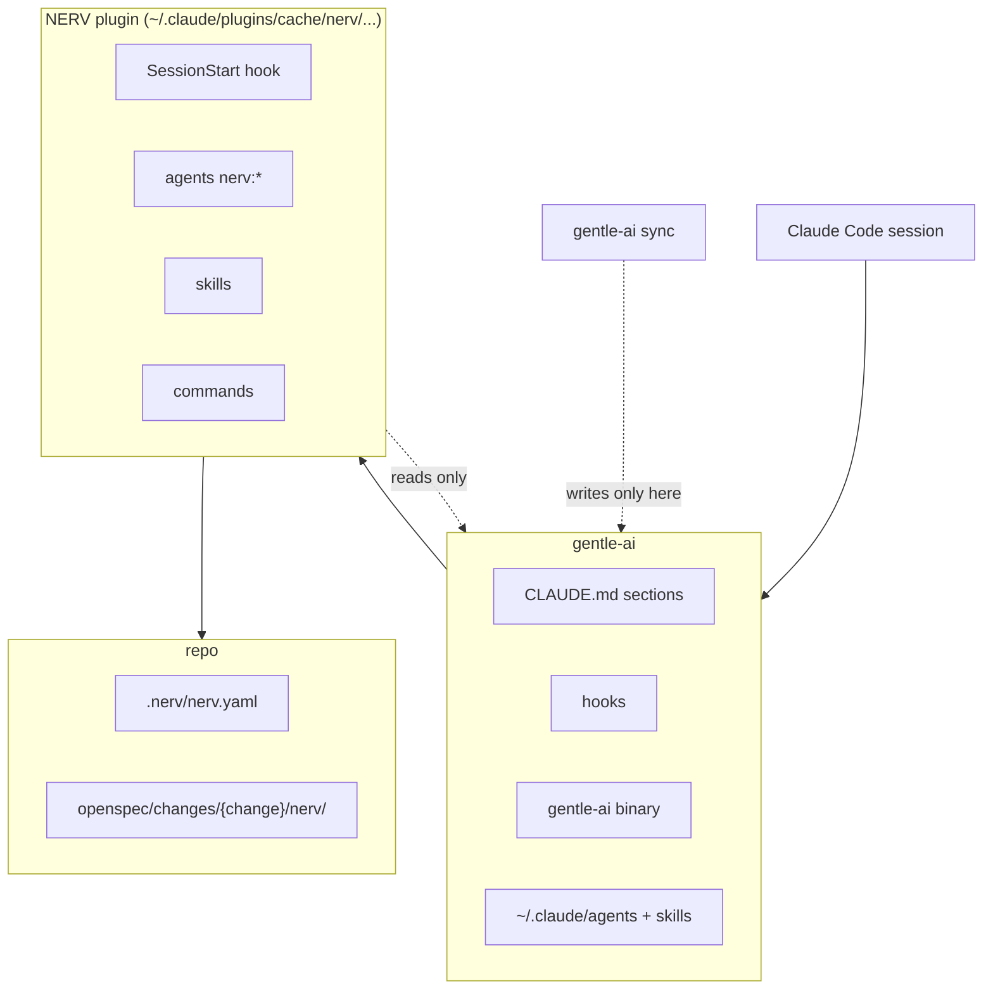
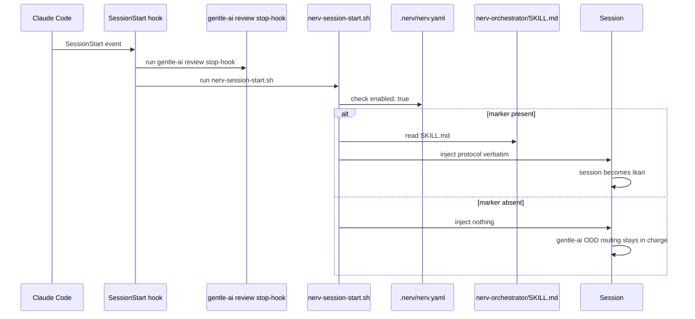
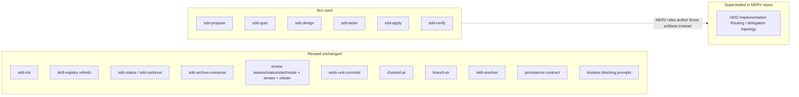
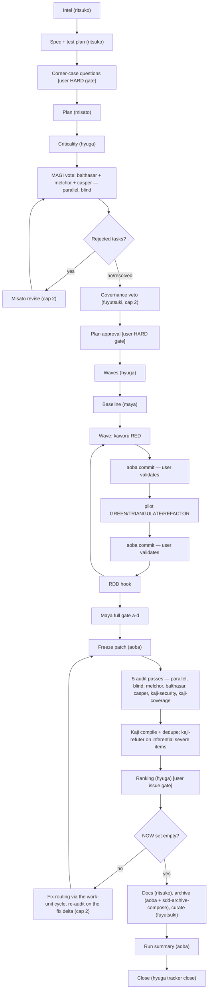
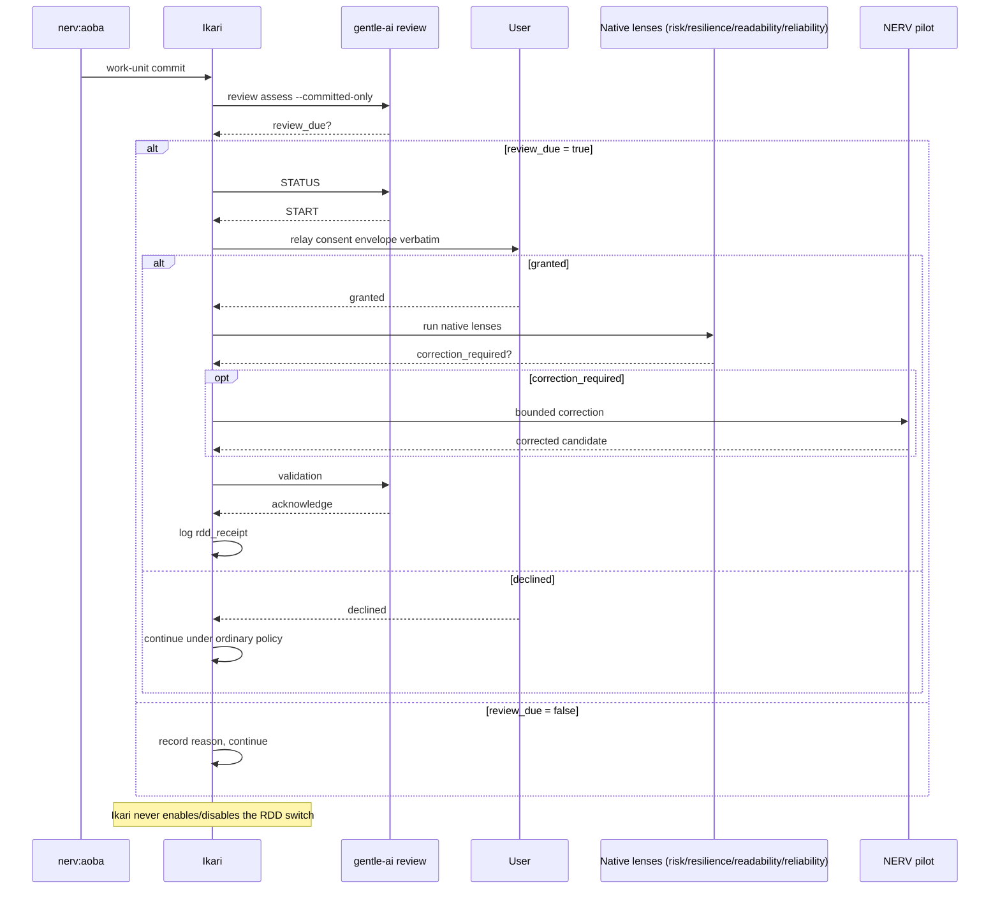

# NERV

NERV is a Claude Code plugin implementing an Evangelion-named multi-agent
governance workflow: Ikari orchestrates, Fuyutsuki holds governance veto,
Misato authors the plan, MAGI (Balthasar / Melchor / Casper) vote per task,
pilots (Rei / Shinji / Asuka / Toji / Kaworu) implement, Kaji compiles a
ranked, multi-pass audit, Maya gates quality, Hyuga owns criticality/waves/
task-tracking, and Aoba handles git operations and the run summary.

NERV brings governance that a plain implementation loop lacks: a per-task
MAGI vote gated by criticality, a governance veto on new skills/scripts/
commands, a mandatory quality gate before any audit, a multi-pass audit
compiler with a ranked user issue gate, an append-only deliberation log, and
a run summary reporting tokens, time, and model per agent.

## Requirements

- **gentle-ai 3.x** — major version 3 is required; minor and patch are free.
  Tested against 3.7.0. 4.x is untested and not supported until NERV's
  contracts (the reuse map below) are re-verified against it.
- Claude Code with plugin marketplaces support (2.1+).
- git.
- bash available to hooks (Git Bash on Windows).
- PowerShell 7, for the installer (`tools/install.ps1`).

Tested against: gentle-ai 3.7.0

## Relation to gentle-ai

NERV is an **overlay**, not a fork. It reuses gentle-ai's native engine and
contracts unchanged — the SDD artifact pipeline, RDD (receipt-driven review),
the skill registry and resolver, strict TDD, delivery budgeting with chained
PRs, and the lossless blocking-prompt contract — and expresses NERV's own
governance on top. NERV never modifies any gentle-ai file: nothing is ever
written under `~/.claude/agents` or `~/.claude/skills`, so `gentle-ai sync`
cannot see or touch it.

## How NERV integrates with gentle-ai

### Layering



NERV sits strictly above gentle-ai and below the repo it governs: Claude Code
loads gentle-ai first (`CLAUDE.md`, its hooks, the `gentle-ai` binary, and
the agents/skills it writes under `~/.claude`), NERV's plugin cache layers
its own hook, agents, skills, and commands on top, and the repo carries only
NERV's own state (`.nerv/nerv.yaml`, the `nerv/` subfolder of each change).
`gentle-ai sync` never sees NERV's files because NERV never writes into the
gentle-ai box, and NERV never writes into it either — it only reads from it.

### Activation



Every session start runs gentle-ai's own `review stop-hook` first, then
NERV's `nerv-session-start.sh`. The NERV hook checks `.nerv/nerv.yaml` for
`enabled: true`; only then does it read and inject
`nerv-orchestrator/SKILL.md` verbatim, which is the moment the session
becomes Ikari. Without the marker the hook injects nothing at all, and
gentle-ai's own ODD Implementation Routing stays in charge of the session.

### Reuse map



NERV calls a large slice of gentle-ai's native engine completely unchanged
(SDD's read-only/mechanical steps, the whole RDD lifecycle, the delivery and
skill-resolution skills, the persistence and lossless-prompt contracts). It
supersedes exactly one thing — gentle-ai's ODD Implementation Routing — with
its own LIGHT/FULL classification and pipelines, only in repos carrying the
`.nerv/nerv.yaml` marker. It never touches the authoring half of SDD
(`sdd-propose` through `sdd-verify`); NERV's own roles (Misato, Ritsuko, the
MAGI, the pilots) author the equivalent artifacts instead.

### LIGHT pipeline

```mermaid
flowchart LR
    A["Preflight"] --> B["Classify: LIGHT"]
    B --> C["nerv:ritsuko intel-light"]
    C --> D["nerv:kaworu RED"]
    D --> E["nerv:aoba commit — user validates"]
    E --> F["pilot GREEN/TRIANGULATE/REFACTOR"]
    F --> G["nerv:maya reduced gate"]
    G --> H["nerv:aoba commit — user validates"]
    H --> I["RDD hook"]
    I --> J["Run summary"]
    J --> K["Close"]
```



LIGHT is the small-change path: after preflight and classification, an
optional Ritsuko micro-intel primes the work, Kaworu writes the failing RED
test, a domain-matched pilot makes it pass, Maya runs a reduced gate scoped
to the touched files only, and Aoba commits twice — once for RED, once
after the gate — each commit validated by the user before it happens. The
RDD hook, run summary, and close steps are shared with FULL.

### FULL pipeline



FULL adds MAGI governance on top of the same LIGHT primitives (RED/GREEN/
REFACTOR, Aoba commits, RDD hook). Ritsuko produces intel and a spec/test
plan gated by a user corner-case interview; Misato's plan goes through
criticality, a blind parallel MAGI vote (with a capped revise loop on
rejection), and Fuyutsuki's governance veto before a single whole-plan user
approval gate. Hyuga's waves then drive per-task implementation cycles
identical to LIGHT's, and Maya runs the full a-d gate. The audit stage then
freezes the patch, runs five blind passes, compiles them through Kaji (with
the refuter on inferential severe items), ranks the issues for a user gate,
routes approved fixes through the work-unit cycle with a re-audit over the
fix delta (capped at 2), and closes with Ritsuko's documentation, the
mechanical archive, Fuyutsuki's log summary, the run summary and the
tracker close.

### RDD per commit



After every Aoba work-unit commit, Ikari assesses that commit against the
last reviewed boundary. When review is due, Ikari relays gentle-ai's native
consent envelope to the user losslessly and verbatim — never deciding on
their behalf. On a grant, the native lenses run, a bounded NERV-pilot
correction applies only if one is required, and an acknowledged receipt is
logged as `rdd_receipt`; on a decline, the run continues under ordinary
repository policy. Ikari itself never enables or disables the RDD switch.

## Install

1. `git clone https://github.com/war-apps/nerv-gentle-ai.git` (the folder path is registered as a local plugin marketplace, so keep the clone where it will stay).
2. `pwsh tools/install.ps1`
3. Restart Claude Code.
4. In any repo where you want NERV active, create `.nerv/nerv.yaml` with:

   ```yaml
   enabled: true
   ```

Run `pwsh tools/install.ps1 -Uninstall` to remove the marketplace and
plugin registration again.

### Updating after local changes

Claude Code snapshots a directory marketplace from the repository's
**committed HEAD** into `~/.claude/plugins/cache/nerv/nerv/<version>/`
(it records the git commit SHA in `installed_plugins.json`). Uncommitted
edits are invisible to sessions. After changing plugin files:

1. Commit the change.
2. Refresh the cache. `claude plugin update nerv@nerv` only re-snapshots
   when `version` in `plugin/.claude-plugin/plugin.json` changed; with the
   same version run `claude plugin uninstall nerv@nerv` followed by
   `claude plugin install nerv@nerv` (settings.json keeps `nerv@nerv`
   enabled, so nothing else changes). `pwsh tools/install.ps1 -RefreshCache`
   does exactly this (both commands, plus a printed `gitCommitSha` check and
   a restart reminder) and can be combined with the normal registration in
   one call.
3. Restart Claude Code.

## Operations

**Activation.** A repo opts in by creating `.nerv/nerv.yaml` with
`enabled: true` — `/nerv:init` writes it interactively (base branch,
worktree policy, skill stacks, task-tracker provider). Without the marker
a session behaves like plain gentle-ai; with it, SessionStart injects the
NERV orchestrator protocol and the session becomes Ikari.

**LIGHT vs. FULL.** Ikari classifies each request LIGHT (one pilot domain,
no new skills/scripts/commands) or FULL (multiple domains, a critical path,
or governance-relevant surface); LIGHT runs a single RED/GREEN/REFACTOR
cycle under a reduced Maya gate, while FULL adds Ritsuko's spec/test-plan,
a blind MAGI vote per task, Fuyutsuki's governance veto, a plan-approval
gate, wave-based implementation, and Kaji's five-pass audit before close.

**Gates a human will see.** The grouped preflight question (task,
worktree, branch, base) when no task/timer is active; a commit-validation
stop before every Aoba commit; the corner-case questions relayed as one
grouped prompt in FULL; the whole-plan approval HARD gate in FULL; the
ranked issue gate after an audit; and the RDD consent envelope after a
commit when review is due. Every one of these is a Lossless Blocking
Prompt — relayed verbatim, never decided on the user's behalf. While one is
open the orchestrator lock carries `waiting_on: user`, so the 15-minute
staleness rule does not apply to it: a resume from another session must
ask before taking over, however long the gate stays open.

**Artifacts.** NERV writes only under `openspec/changes/{change}/nerv/`
(deliberation log, exploration, test plan, votes, veto ruling, waves,
Maya reports, audit rounds, run summary) plus the shared gentle-ai SDD
files (`state.yaml`, `proposal.md`, `design.md`, `tasks.md`, `specs/`) at
the change root. `.nerv/nerv.yaml` (project scope) and
`~/.claude/nerv/nerv.yaml` (user scope) hold configuration; nothing is
ever written under `~/.claude/agents` or `~/.claude/skills`.

**Artifacts commit policy.** `artifacts.commit` controls when the `nerv/`
folder is committed: `with-change` (each work-unit commit includes its own
NERV artifacts), `at-close` (default — artifacts land in one
`docs: nerv artifacts for {change}` commit when the run closes), or
`never` (artifacts stay untracked; the user commits them manually, if
ever).

**Task tracker.** `tasks.provider` selects `teamwork` (implemented today),
`github-projects` or `jira` (schema stubs only, not wired), or `none` (no
tracker calls; the preflight still asks worktree/branch). Hyuga's
`DISPATCH: tracker` drives create/start/moveStage/block/close/done against
the configured provider. The 16 `/task:*` commands read the same single
`nerv.yaml` config (user + project scope) instead of hardcoded values.

**`/nerv:status`.** Reports gentle-ai major-version compatibility, the
active config (merged user + project), and — while a run is in progress —
the orchestrator lock state (`nerv/.orchestrator.lock`: holder, step,
`waiting_on`, heartbeat age); the lock line disappears once the run closes.

## Troubleshooting

- **Plugin cache still shows old files after an edit.** Claude Code
  snapshots directory marketplaces from the repo's *committed* HEAD, not
  the working tree (see "Updating after local changes" above). Commit,
  then reinstall — `pwsh tools/install.ps1 -RefreshCache` — and restart
  Claude Code.
- **`gentle-ai review status` times out around 25 s on a bound lineage.**
  Observed `operation_timeout` on the pre-native STATUS budget
  (`reviewFacadeOperationTimeout`, no env override). Retry once; if it
  keeps failing, continue without that review (ordinary policy) or reduce
  the reviewed scope and try again.
- **`lens_context_budget_exceeded` on a review.** The accumulated range is
  too large for the reviewer context. Review commit by commit from a
  detached review worktree (`git worktree add --detach`; lineages share
  the same `.git`), and keep individual commits near the ~400-line
  delivery-budget heuristic so each fits.
- **The `sdd-archive` agent refuses to launch.** gentle-ai's SDD dispatcher
  refuses `sdd-archive` outside a native SDD session (it wants an
  interactive AskUserQuestion preflight NERV doesn't run). NERV archives
  mechanically instead — Aoba runs `git mv` plus
  `gentle-ai sdd-archive-compose` per delta spec.
- **A launch dies under memory pressure.** The protocol retries the launch
  once. If the session itself is interrupted, resuming is safe: the
  orchestrator lock and its heartbeat let a resume session detect and take
  over a genuinely dead run without re-voting frozen tasks or re-running
  closed waves.
- **Commits carry a stray `Co-Authored-By` trailer.** The harness
  attribution reminder some environments inject is ignored by Aoba on
  purpose — NERV commits never carry AI attribution trailers; a gatekeeper
  check greps the commit message for this before it lands.
- **`createTask` blocks with "tasklist not found."** A stale
  `tasks.providers.teamwork.tasklist_id` (or `project_id`) in `nerv.yaml`.
  Fix the config (project or user scope) and re-run; the preflight is
  designed to stop and re-ask rather than silently create the task
  elsewhere.
- **Extra reviewer sessions appear on every tool use.** That's the
  `security-guidance` plugin's own hook (installed independently — see
  `install-claude-skills-global.ps1`), not NERV. NERV's own review relay
  only runs after an Aoba work-unit commit.

## Known limitations

- **Audit coverage tracks the test plan.** Kaji's passes flag what the
  test plan and code disagree on; a scenario the user explicitly declined
  during the corner-case interview is a recorded decision, not a missing
  case, and will not surface as a finding.
- **GitHub Projects and Jira are schema stubs.** `tasks.providers.
  github-projects` and `tasks.providers.jira` parse and validate, but no
  adapter dispatches against either API yet — only `teamwork` is wired.
- **Interactive gates can't be driven by `claude -p`.** Non-interactive
  harness runs (`bench/journeys.md`'s default variant) pre-answer every
  blocking prompt in the launch context; the interactive variants exist
  precisely because a batch session cannot answer an
  `AskUserQuestion`-shaped prompt itself.
- **RDD advisory findings aren't a separate backlog.** Non-blocking
  findings from an acknowledged review receipt are recorded inline in the
  feature document (`odd/tasks/<feature>.md`), not tracked in a dedicated
  issue list.
- **Reviewed-boundary bookkeeping is per branch.** The "last reviewed
  commit" that RDD assessment walks forward from is tracked per branch,
  not per change or per worktree; rebasing or cherry-picking across
  branches can make that boundary stale.

## Status

Phases 0 through 5 are complete (2026-09-24 through 2026-09-25): the
overlay mechanism, the LIGHT path, the FULL path with MAGI governance, the
audit and closure stage, the task-tracking layer with the single config
file, and Phase 5 hardening (orchestrator lock/heartbeat, safe resume,
artifacts commit policy, installer and README parity). 18 agents ship;
journeys J0 through J5 are green in the bench repo. `bench/journeys.md`
is the source of truth for what was actually observed at each phase.

## Roadmap

- **Phase 0 (done, 2026-09-24)** — Overlay mechanism proven: `aoba`,
  `/nerv:status`, the SessionStart hook, the installer.
- **Phase 1 (done, 2026-09-24)** — LIGHT path end to end: the Ikari
  protocol (classification, delegation triggers, RDD relay, usage
  collection), `ritsuko`, `shinji`, `kaworu`, `maya`, and `/nerv:init`.
- **Phase 2 (done, 2026-09-24)** — FULL path with MAGI: `misato`, `hyuga`,
  `balthasar`, `melchor`, `casper`, `fuyutsuki`, the vote/veto/waves
  artifacts, and the plan-approval HARD gate.
- **Phase 3 (done, 2026-09-24)** — Audit and closure: `kaji`,
  `kaji-security`, `kaji-coverage`, `kaji-refuter`, the frozen-patch audit
  passes, ranked issue gate, fix routing, and archive.
- **Phase 4 (done, 2026-09-25)** — Task-tracking layer (Hyuga) and single
  config file: the provider-agnostic task port, the Teamwork adapter, the
  preflight question for task/worktree/branch/base, and the `/task:*`
  command migration.
- **Phase 5 (done, 2026-09-25)** — Hardening: the orchestrator lock and
  safe resume protocol, the artifacts commit policy, the full
  `bench/journeys.md` suite (J0-J5, plus J6's non-interactive and
  interactive design), README parity, and installer `-RefreshCache`.

## Roles

| Role | One-line responsibility |
|---|---|
| `fuyutsuki` | Governance veto ruling on new skills/scripts/commands; curates the deliberation log. |
| `ritsuko` | Intel, spec + test plan, and docs — three spawns per run. |
| `misato` | Authors the proposal, design, and tasks; issues binding rulings. |
| `balthasar` | MAGI vote member (per-task vote and audit passes). |
| `melchor` | MAGI vote member — the strong-model side of the MAGI asymmetry. |
| `casper` | MAGI vote member; also runs in AUDIT mode. |
| `rei` | Pilot — implements assigned tasks within a wave. |
| `shinji` | Pilot — implements assigned tasks within a wave. |
| `asuka` | Pilot — implements assigned tasks within a wave. |
| `toji` | Pilot — implements assigned tasks within a wave. |
| `kaworu` | Pilot — commits the failing (RED) test before the pilot's GREEN implementation. |
| `kaji` | Compiles and dedupes the multi-pass audit into `audit-report.md`. |
| `kaji-security` | Audit pass focused on security. |
| `kaji-coverage` | Audit pass focused on test coverage. |
| `kaji-refuter` | Detached read-only refuter for the audit's inferential findings batch. |
| `maya` | Quality gate — runs tests, lint, and build across phases a-d. |
| `hyuga` | Criticality, waves, issue ranking, and task-tracker dispatch. |
| `aoba` | Git operations and run telemetry — commits, delivery prep, and the run summary. |

Ikari (the orchestrator) is the session itself, not a spawnable agent — see
`plugin/skills/nerv-orchestrator/SKILL.md`.

## Configuration schema

Every NERV setting lives in `nerv.yaml`. There are exactly two copies, same
schema: user scope `~/.claude/nerv/nerv.yaml` (personal defaults, never
committed) and project scope `<repo>/.nerv/nerv.yaml` (committed). Project
overrides user key by key; a missing key falls back to the user file, then
to the built-in default.

```yaml
# ~/.claude/nerv/nerv.yaml (user) and <repo>/.nerv/nerv.yaml (project): same schema
enabled: true                       # project scope only: activates NERV in this repo
skills:                             # stacks per consuming role; names must exist in .atl/skill-registry.md
  testing: [tdd, playwright-best-practices]                        # ritsuko, kaworu, maya
  code: [dotnet-best-practices, typescript-best-practices]         # pilots
  best-practices: [best-practices, solid-principles, clean-code-guard]  # balthasar
  architecture: [hexagonal-architecture, c4-architecture]          # melchor
  audit: [security-review, clean-code-guard]                       # kaji passes
critical_paths: [auth/, payments/, migrations/, infra/]            # Hyuga auto-critical
artifacts:
  commit: at-close                  # with-change | at-close | never (default: at-close)
git:
  base_branch: develop              # default base for the worktree offer
  worktree: ask                     # ask | always | never
  branch_pattern: "feature/{prefix}-{id}-{slug}"   # prefix comes from the provider (tw, gh, jira)
  commit_ref_pattern: "({PREFIX}-{id})"
tasks:
  provider: teamwork                # teamwork | github-projects | jira | none ; "ask" when absent
  ask_when_missing: true            # preflight asks task + worktree + branch if no active task
  subtasks_per_wave: false
  providers:                        # one block per provider, only the enabled one is required
    teamwork:
      task_ref_prefix: tw           # {prefix} in branch_pattern / commit_ref_pattern
      assignee_id: 686035           # user scope
      project_id: 1271726           # project scope
      tasklist_id: 3951970          # project scope
      stages: { inDev: DESARROLLO, testing: TESTING, implemented: IMPLEMENTA, blocked: BLOQUEA, canceled: CANCEL, pending: PENDIENTE, analysis: ANALISIS }
    github-projects: { task_ref_prefix: gh, owner: "", project_number: 0 }    # later
    jira: { task_ref_prefix: jira, site: "", project_key: "" }               # later
  sources:                          # extra work sources for listings (replaces ~/.claude/work/sources.md)
    - { name: erp-proveedores, type: google-sheets, ... }
```
