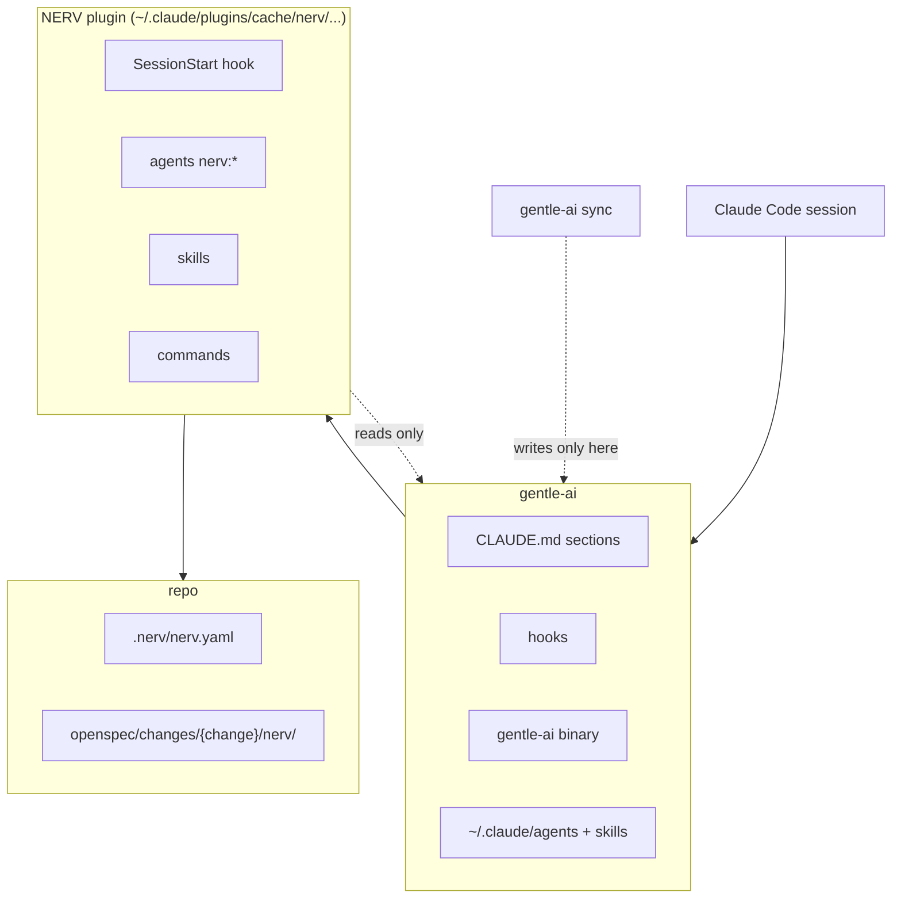
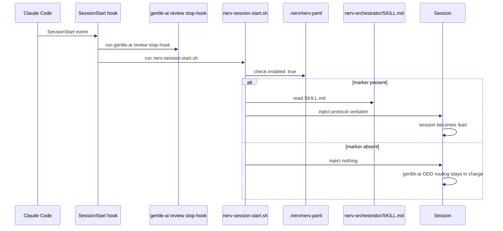
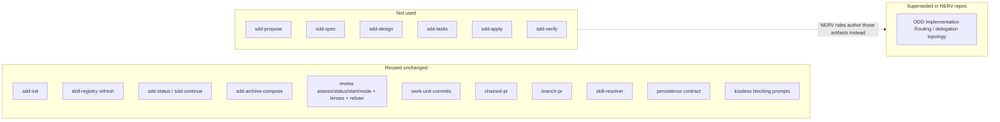
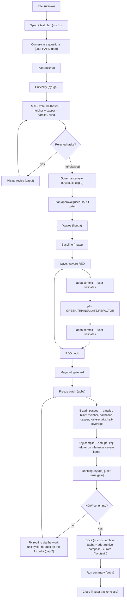
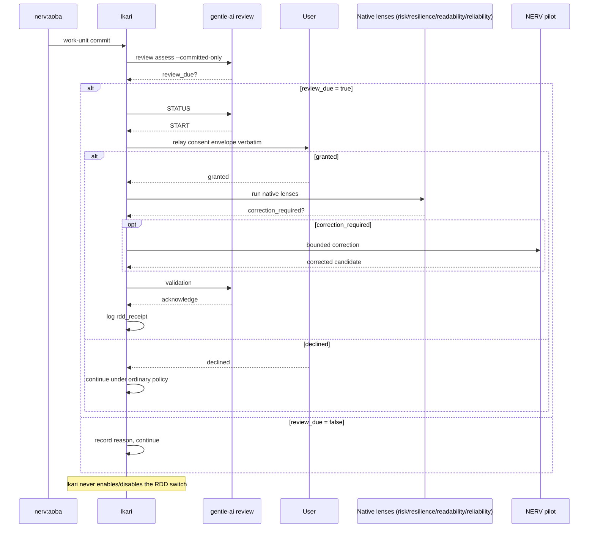

# NERV Gentle-AI

<p align="center">
  <a href="https://github.com/Gentleman-Programming/gentle-ai"></a>
  <a href="https://code.claude.com/docs"></a>
  <a href="https://github.com/PowerShell/PowerShell"></a>
  <a href="https://www.gnu.org/software/bash/"></a>
  <a href="https://www.markdownguide.org/"></a>
  <a href="https://mermaid.js.org/"></a>
  <a href="https://yaml.org/"></a>
  <a href="https://github.com/Gentleman-Programming/gentle-ai"></a>
  <a href="https://github.com/Gentleman-Programming/engram"></a>
  <a href="https://www.teamwork.com/"></a>
  <a href="https://skills.sh/"></a>
  <a href="https://git-scm.com/"></a>
</p>

<p align="center">
  <a href="https://github.com/Gentleman-Programming/gentle-ai"></a>
</p>

NERV Gentle-AI is a Claude Code plugin implementing an Evangelion-named
multi-agent governance workflow. Ikari orchestrates a cast of named
agents through it; see "Roles" below for what each one does and when it
runs.

NERV Gentle-AI brings governance that a plain implementation loop lacks: a
per-task MAGI vote gated by criticality, a governance veto on new
skills/scripts/commands, a mandatory quality gate before any audit, a
multi-pass audit compiler with a ranked user issue gate, an append-only
deliberation log, and a run summary reporting tokens, time, and model per
agent.

## Roles

Ikari is the main Claude Code session itself, not a spawnable agent — the
sole spawner that launches every role below, classifies each request,
relays every blocking gate to the user, and never delegates that
authority to anyone it launches.

| Agent | Role | Runs when | Produces | Default model / effort | Tools (summary) |
|---|---|---|---|---|---|
| `fuyutsuki` | Governance veto over new skills/scripts/commands; curates the deliberation log | FULL plan step, after the MAGI vote; end of every run | `nerv/veto-ruling.md`; curated `## Summary` in `nerv/deliberation-log.md` | sonnet / medium | Read, Write, Glob, Grep, Engram search/save |
| `misato` | Operations director — authors `proposal.md`/`design.md`/`tasks.md`, revises exactly what the MAGI vote rejects, rules on deviations and test-vs-implementation disputes | FULL plan step; after a rejected MAGI vote or a veto; on demand for a ruling | `proposal.md`, `design.md`, `tasks.md`; ruling entries | fable / high | Read, Write, Glob, Grep, Engram search/save |
| `ritsuko` | Chief scientist — codebase/history intel, test planning with a corner-case interview, end-of-run docs | LIGHT micro-intel; FULL intel and spec/test-plan steps; end-of-run documentation | `exploration-light.md`/`exploration.md`, `specs/{domain}/spec.md`, `nerv/test-plan.md`, doc deltas | opus / high | Read, Glob, Grep, WebFetch, WebSearch, Engram search/save |
| `balthasar` | MAGI vote (VOTE mode): software-principles lens — SOLID, KISS, YAGNI, DRY, patterns; also an AUDIT-mode pass in Phase 3 | FULL blind MAGI vote round, per task; Phase 3 audit round | VOTE/AUDIT JSON, merged by Ikari into `nerv/votes.md`/`nerv/audit-report.md` | sonnet / medium | Read, Glob, Grep, Engram search |
| `melchor` | MAGI vote (VOTE mode): structure/security lens — architecture, dead code, duplication, security; the deliberately strongest MAGI model; also an AUDIT-mode pass | same | same | fable / high | Read, Glob, Grep, Engram search |
| `casper` | MAGI vote (VOTE mode): process lens — docs, comments, scope, commit hygiene, plan consistency; its AUDIT-mode pass also checks plan conformance and TDD commit order | same | same | sonnet / medium | Read, Glob, Grep, Engram search |
| `rei` | Pilot — owns data: persistence, migrations, caches, observability, and that layer's security | GREEN/REFACTOR after Kaworu's RED, on data work units | source and tests in the working tree, TDD evidence | sonnet / medium | Read, Edit, Write, Glob, Grep, Bash, Engram search |
| `shinji` | Pilot — owns the backend and its security | GREEN/REFACTOR after Kaworu's RED, on backend work units | source and tests in the working tree, TDD evidence | sonnet / medium | Read, Edit, Write, Glob, Grep, Bash, Engram search |
| `asuka` | Pilot — owns the frontend: UI, state, accessibility, and client-side security | GREEN/REFACTOR after Kaworu's RED, on frontend work units | source and tests in the working tree, TDD evidence | sonnet / medium | Read, Edit, Write, Glob, Grep, Bash, Engram search |
| `toji` | Pilot — owns infrastructure: CI/CD, Docker, Kubernetes, and infra security | GREEN/REFACTOR after Kaworu's RED, on infra work units (validation commands substitute for RED/GREEN where no runner exists) | source, manifests and pipelines in the working tree, TDD evidence or a validation-commands report | sonnet / medium | Read, Edit, Write, Glob, Grep, Bash, Engram search |
| `kaworu` | Pilot — writes the failing RED test first for every work unit, before any pilot's GREEN step; never a domain owner | before every GREEN step, in both LIGHT and FULL | the RED test file; RED row of the TDD Cycle Evidence table | sonnet / medium | Read, Edit, Write, Glob, Grep, Bash, Engram search |
| `maya` | Quality gate — runs tests/lint/build, reproduces the TDD evidence pilots reported, routes failures to whoever owns them | LIGHT reduced gate; FULL baseline (phase 0) and full a-d gate (phase 2) | `nerv/maya-report.md` | sonnet / medium | Read, Bash, Glob, Grep, Write, Engram search/save |
| `kaji` | Audit compiler — merges and dedupes the five audit passes, prepares the refuter batch, carries unresolved items across re-audit rounds | Phase 3, once per audit round, after the five passes return | `nerv/audit-report.md` | opus / high | Read, Glob, Grep, Write, Engram search/save |
| `kaji-security` | Audit pass — security across every layer: injection, authz, secrets, data exposure, unsafe defaults, dependencies, crypto, infra hardening | Phase 3, one of five parallel blind passes | JSON findings, merged by Kaji into `nerv/audit-report.md` | sonnet / medium | Read, Glob, Grep, Engram search |
| `kaji-coverage` | Audit pass — implemented tests versus Ritsuko's test plan: missing cases, weakened or tautological assertions, untested acceptance criteria | Phase 3, one of five parallel blind passes | JSON findings, merged by Kaji into `nerv/audit-report.md` | sonnet / medium | Read, Glob, Grep, Engram search |
| `kaji-refuter` | Detached, read-only refuter — attacks the round's inferential BLOCKER/CRITICAL findings with concrete counter-evidence | Phase 3, only when Kaji's refuter batch is non-empty | corroborated/refuted/inconclusive verdicts, folded by Kaji into `nerv/audit-report.md`'s `### Refuted` | sonnet / medium | Read, Glob, Grep, Engram search |
| `hyuga` | Plan and issue operations — four dispatches: `criticality`, `waves`, `wave-report`, `ranking`, plus the provider-agnostic task-tracker dispatch | criticality before the MAGI vote; waves after plan approval; wave-report during implementation; ranking after the refuter; tracker at preflight, Maya's full-gate start, the issue gate, and close | `nerv/criticality.md`, `nerv/waves.md`, `nerv/issue-ranking.md`; tracker op result inline | sonnet / medium | Read, Write, Glob, Grep, Bash, Engram search/save, Teamwork MCP |
| `aoba` | Git operations and run telemetry — organizes user-validated commits, freezes audit patches, archives closed changes, writes the run summary | after every user-validated work unit; patch freeze before each audit round; archive and run summary at close | conventional commits, `nerv/audit/diff-round-N.patch`, the archived change folder, `nerv/run-summary.md` | sonnet / low | Bash, Read, Glob, Grep, Write, Engram search/save |

**How a run flows.** Every request is classified once, before the first
agent launch: LIGHT for a small, single-domain change, FULL for anything
touching two or more pilot domains, a critical path, a new
skill/script/command, or a large diff. LIGHT runs one RED/GREEN/REFACTOR
cycle — Kaworu's failing test, a domain-matched pilot, Aoba's
user-validated commits, and a reduced Maya gate — shown in the "LIGHT
pipeline" diagram further below. FULL adds Ritsuko's spec and
corner-case interview, Misato's plan, a blind per-task MAGI vote,
Fuyutsuki's governance veto, a whole-plan approval gate, Hyuga's
dependency waves, Maya's full a-d gate, and a five-pass, Kaji-compiled
audit behind a ranked user issue gate, shown in the "FULL pipeline"
diagram further below. Both pipelines share the same RED/GREEN/REFACTOR
primitive, the same Aoba commit-and-validate step, and the same native
RDD review relay after every commit, detailed in "RDD per commit" further
down.

## Requirements

- **gentle-ai 3.x** — major version 3 is required; minor and patch are free.
  Tested against 3.7.0. 4.x is untested and not supported until NERV
  Gentle-AI's contracts (the reuse map below) are re-verified against it.
- Claude Code with plugin marketplaces support (2.1+).
- git.
- bash available to hooks (Git Bash on Windows).
- PowerShell 7, for the installer (`tools/install.ps1`).
- Engram (`engram` on PATH) is optional — without it the installer skips
  the "nerv" knowledge-base check (see "Engram project detection" below).

Tested against: gentle-ai 3.7.0

## Relation to gentle-ai

NERV Gentle-AI is an **overlay**, not a fork. It reuses gentle-ai's native
engine and contracts unchanged — the SDD artifact pipeline, RDD
(receipt-driven review), the skill registry and resolver, strict TDD,
delivery budgeting with chained PRs, and the lossless blocking-prompt
contract — and expresses NERV Gentle-AI's own governance on top. NERV
Gentle-AI never modifies any gentle-ai file: nothing is ever written
under `~/.claude/agents` or `~/.claude/skills`, so `gentle-ai sync` cannot
see or touch it.

## How NERV Gentle-AI integrates with gentle-ai

### Layering



NERV Gentle-AI sits strictly above gentle-ai and below the repo it
governs: Claude Code loads gentle-ai first (`CLAUDE.md`, its hooks, the
`gentle-ai` binary, and the agents/skills it writes under `~/.claude`),
NERV Gentle-AI's plugin cache layers its own hook, agents, skills, and
commands on top, and the repo carries only NERV Gentle-AI's own state
(`.nerv/nerv.yaml`, the `nerv/` subfolder of each change). `gentle-ai
sync` never sees NERV Gentle-AI's files because NERV Gentle-AI never
writes into the gentle-ai box, and NERV Gentle-AI never writes into it
either — it only reads from it.

### Activation



Every session start runs gentle-ai's own `review stop-hook` first, then
NERV Gentle-AI's `nerv-session-start.sh`. The NERV Gentle-AI hook checks
`.nerv/nerv.yaml` for `enabled: true`; only then does it read and inject
`nerv-orchestrator/SKILL.md` verbatim, which is the moment the session
becomes Ikari. Without the marker the hook injects nothing at all, and
gentle-ai's own ODD Implementation Routing stays in charge of the session.

### Reuse map



NERV Gentle-AI calls a large slice of gentle-ai's native engine completely
unchanged (SDD's read-only/mechanical steps, the whole RDD lifecycle, the
delivery and skill-resolution skills, the persistence and lossless-prompt
contracts). It supersedes exactly one thing — gentle-ai's ODD
Implementation Routing — with its own LIGHT/FULL classification and
pipelines, only in repos carrying the `.nerv/nerv.yaml` marker. It never
touches the authoring half of SDD (`sdd-propose` through `sdd-verify`);
NERV Gentle-AI's own roles (Misato, Ritsuko, the MAGI, the pilots) author
the equivalent artifacts instead.

### LIGHT pipeline

```mermaid
flowchart LR
    A["Preflight"] --> B["Classify: LIGHT"]
    B --> C["nerv:ritsuko intel-light"]
    C --> D["nerv:kaworu RED"]
    D --> E["nerv:aoba commit — user validates"]
    E --> F["pilot GREEN/TRIANGULATE/REFACTOR"]
    F --> G["nerv:maya reduced gate"]
    G --> H["nerv:aoba commit — user validates"]
    H --> I["RDD hook"]
    I --> J["Run summary"]
    J --> K["Close"]
```



LIGHT is the small-change path: after preflight and classification, an
optional Ritsuko micro-intel primes the work, Kaworu writes the failing RED
test, a domain-matched pilot makes it pass, Maya runs a reduced gate scoped
to the touched files only, and Aoba commits twice — once for RED, once
after the gate — each commit validated by the user before it happens. The
RDD hook, run summary, and close steps are shared with FULL.

### FULL pipeline



FULL adds MAGI governance on top of the same LIGHT primitives (RED/GREEN/
REFACTOR, Aoba commits, RDD hook). Ritsuko produces intel and a spec/test
plan gated by a user corner-case interview; Misato's plan goes through
criticality, a blind parallel MAGI vote (with a capped revise loop on
rejection), and Fuyutsuki's governance veto before a single whole-plan user
approval gate. Hyuga's waves then drive per-task implementation cycles
identical to LIGHT's, and Maya runs the full a-d gate. The audit stage then
freezes the patch, runs five blind passes, compiles them through Kaji (with
the refuter on inferential severe items), ranks the issues for a user gate,
routes approved fixes through the work-unit cycle with a re-audit over the
fix delta (capped at 2), and closes with Ritsuko's documentation, the
mechanical archive, Fuyutsuki's log summary, the run summary and the
tracker close.

### RDD per commit



After every Aoba work-unit commit, Ikari assesses that commit against the
last reviewed boundary. When review is due, Ikari relays gentle-ai's native
consent envelope to the user losslessly and verbatim — never deciding on
their behalf. On a grant, the native lenses run, a bounded correction from
a NERV Gentle-AI pilot applies only if one is required, and an
acknowledged receipt is
logged as `rdd_receipt`; on a decline, the run continues under ordinary
repository policy. Ikari itself never enables or disables the RDD switch.

## Setup

After installing the plugin (see "Install" below), the fastest way to
configure NERV Gentle-AI is from inside Claude Code, once:

```
pwsh tools/install.ps1
```

then run:

```
/nerv:configure
```

`/nerv:configure` asks the same questions as the terminal wizard below,
through native blocking prompts, pre-filled from the current config, and
applies only the answers you confirm — see "`/nerv:configure`" in
"Operations" further down. The scripts themselves now live under
`plugin/tools/` in the installed plugin cache
(`${CLAUDE_PLUGIN_ROOT}/tools/*.ps1`); the root `tools/*.ps1` scripts in
this repository are thin forwarders kept for the terminal workflow below.

From a terminal instead, run the same wizard directly:

```
pwsh tools/install.ps1 -Configure
```

or, if the plugin is already installed:

```
pwsh tools/configure.ps1
```

The same script also runs without prompts, which is what `/nerv:configure`
drives: `-Print` emits the current state as JSON (config path,
prerequisites, managed values next to their defaults, per-role models,
skills status); `-Set key=value` (repeatable), `-SetModel
role=model[/effort]` (or `role=from:<gentle-ai-phase>`, `role=default`),
`-InitRepo <path>` with `-RepoBase`/`-RepoProvider`/`-RepoProjectId`/
`-RepoTasklistId`, and `-InstallCommands` apply one change each; `-Json`
returns a summary of what changed and what was written. Nothing is written
when nothing changed, and the script exits 1 on a rejected key or value.

The wizard runs six sections, each skippable (`-SkipSkills`, `-SkipModels`,
`-SkipRepos`, `-SkipCommands`, `-NoRefresh`):

1. **Prerequisites** — informational checks for `gentle-ai` (major version
   3 required), `engram` (optional), and `claude` (required for the
   refresh step).
1. **Required skills** — `tools/install-skills.ps1` reads
   `tools/skills-manifest.json` (the nine external skills the plugin
   defaults reference, with their skills.sh sources; the five gentle-ai
   ones; the `security-review` built-in), installs the missing external
   ones with `npx skills add <repo> --skill <id> -g -a claude-code -y`, and
   names `gentle-ai install`/`sync` as the remedy for missing gentle-ai
   skills. Already-present skills are never touched; `-DryRun` previews.
   `pwsh tools/install.ps1 -Skills` runs the same step without the wizard.
2. **User config** — asks `git` (base branch, worktree policy, branch and
   commit-ref patterns), `tasks` (provider, ask-when-missing,
   subtasks-per-wave, timer store, rounding minutes, and — when the
   provider is Teamwork — the ref prefix, assignee id, default
   project/tasklist ids, and the seven workflow-stage names), `skills`
   (one comma-separated stack per consuming role), `critical_paths`, and
   `artifacts.commit`, then writes `~/.claude/nerv/nerv.yaml`, backing up
   any existing file first. Every field the wizard changes is edited **in
   place** — same line, same indentation, existing trailing comment kept —
   and a field left unchanged (Enter keeps the shown value) is never
   rewritten at all; a whole block (`git:`, `tasks:`, `skills:`,
   `artifacts:`, or the `providers.teamwork` sub-block) is only generated
   fresh when it is missing from the file entirely. Nothing the wizard has
   no field for — extra keys, `known_projects:`, `sources:`,
   `sources_howto:`, or anything else you added by hand — is ever dropped
   or regenerated.
3. **Models** — optionally launches `tools/configure-models.ps1` for
   per-role model/effort overrides (see "Configuring models and effort"
   below).
4. **Repos** — optionally writes `.nerv/nerv.yaml` in one or more local
   git repositories (base branch, task provider, and — for Teamwork —
   this repo's project/tasklist ids), leaving an already-initialized repo
   untouched.
5. **Slash commands** — optionally copies the Teamwork procedures under
   `plugin/skills/nerv-tasks/providers/teamwork/procedures/` into
   `~/.claude/commands/task/` as the 16 `/task:*` commands, never
   overwriting a file that already exists there.
6. **Apply and refresh** — optionally applies the resolved `models:`
   block to the plugin cache and runs `tools/install.ps1 -RefreshCache`.

Every prompt shows its current or default value in brackets; Enter keeps
it. `-AnswersFile <path>` drives the whole wizard from a text file (one
answer per line) instead of prompting, for scripted setup.

After the wizard, open Claude Code in each configured repository and run
`/nerv:init` once — this bootstraps gentle-ai's SDD registry when it is
missing; the wizard itself only writes `.nerv/nerv.yaml`.

Outside the wizard, the plugin stays self-contained apart from these
requirements: **gentle-ai 3.x** installed and configured (`gentle-ai
install`), **Claude Code** with the **Teamwork MCP** configured when the
Teamwork task-tracker adapter is used, and **Engram** (optional — used for
the shared `nerv` knowledge base and per-repo memory detection).

## Install

1. `git clone https://github.com/war-apps/nerv-gentle-ai.git` (the folder path is registered as a local plugin marketplace, so keep the clone where it will stay).
2. `pwsh tools/install.ps1`
3. Restart Claude Code.
4. In any repo where you want NERV Gentle-AI active, create
   `.nerv/nerv.yaml` with:

   ```yaml
   enabled: true
   ```

   Or run `pwsh tools/configure.ps1` (see "Setup" above) to generate it
   interactively instead.

Run `pwsh tools/install.ps1 -Uninstall` to remove the marketplace and
plugin registration again.

### Updating after local changes

Claude Code snapshots a directory marketplace from the repository's
**committed HEAD** into `~/.claude/plugins/cache/nerv/nerv/<version>/`
(it records the git commit SHA in `installed_plugins.json`). Uncommitted
edits are invisible to sessions. After changing plugin files:

1. Commit the change.
2. Refresh the cache. `claude plugin update nerv@nerv` only re-snapshots
   when `version` in `plugin/.claude-plugin/plugin.json` changed; with the
   same version run `claude plugin uninstall nerv@nerv` followed by
   `claude plugin install nerv@nerv` (settings.json keeps `nerv@nerv`
   enabled, so nothing else changes). `pwsh tools/install.ps1 -RefreshCache`
   does exactly this (both commands, plus a printed `gitCommitSha` check and
   a restart reminder) and can be combined with the normal registration in
   one call.
3. Restart Claude Code.

`-RefreshCache` also applies the `models:` block's `effort` overrides to the
refreshed cache (see "Configuration schema" → `models:`), so a code change
and a pending effort override land together. If you only edited `models:`
in `~/.claude/nerv/nerv.yaml` — no plugin file changed — skip the reinstall
and run `pwsh tools/install.ps1 -ApplyModels` on its own instead.

## Operations

**Activation.** A repo opts in by creating `.nerv/nerv.yaml` with
`enabled: true` — `/nerv:init` writes it interactively (base branch,
worktree policy, skill stacks, task-tracker provider), and `/nerv:configure`
revisits any of those choices afterwards. Without the marker a session
behaves like plain gentle-ai; with it, SessionStart injects the NERV
Gentle-AI orchestrator protocol and the session becomes Ikari.

**LIGHT vs. FULL.** Ikari classifies each request LIGHT (one pilot domain,
no new skills/scripts/commands) or FULL (multiple domains, a critical path,
or governance-relevant surface); LIGHT runs a single RED/GREEN/REFACTOR
cycle under a reduced Maya gate, while FULL adds Ritsuko's spec/test-plan,
a blind MAGI vote per task, Fuyutsuki's governance veto, a plan-approval
gate, wave-based implementation, and Kaji's five-pass audit before close.

**Gates a human will see.** The grouped preflight question (task,
worktree, branch, base) when no task/timer is active; a commit-validation
stop before every Aoba commit; the corner-case questions relayed as one
grouped prompt in FULL; the whole-plan approval HARD gate in FULL; the
ranked issue gate after an audit; and the RDD consent envelope after a
commit when review is due. Every one of these is a Lossless Blocking
Prompt — relayed verbatim, never decided on the user's behalf. While one is
open the orchestrator lock carries `waiting_on: user`, so the 15-minute
staleness rule does not apply to it: a resume from another session must
ask before taking over, however long the gate stays open.

**Artifacts.** NERV Gentle-AI writes only under
`openspec/changes/{change}/nerv/` (deliberation log, exploration, test
plan, votes, veto ruling, waves,
Maya reports, audit rounds, run summary) plus the shared gentle-ai SDD
files (`state.yaml`, `proposal.md`, `design.md`, `tasks.md`, `specs/`) at
the change root. `.nerv/nerv.yaml` (project scope) and
`~/.claude/nerv/nerv.yaml` (user scope) hold configuration; nothing is
ever written under `~/.claude/agents` or `~/.claude/skills`.

**Artifacts commit policy.** `artifacts.commit` controls when the `nerv/`
folder is committed: `with-change` (each work-unit commit includes its own
NERV Gentle-AI artifacts), `at-close` (default — artifacts land in one
`docs: nerv artifacts for {change}` commit when the run closes), or
`never` (artifacts stay untracked; the user commits them manually, if
ever).

**Task tracker.** `tasks.provider` selects `teamwork` (implemented today),
`github-projects` or `jira` (schema stubs only, not wired), or `none` (no
tracker calls; the preflight still asks worktree/branch). Hyuga's
`DISPATCH: tracker` drives create/start/moveStage/block/close/done against
the configured provider. The 16 `/task:*` commands read the same single
`nerv.yaml` config (user + project scope) instead of hardcoded values.

**`/nerv:status`.** Reports gentle-ai major-version compatibility, the
active config (merged user + project), and — while a run is in progress —
the orchestrator lock state (`nerv/.orchestrator.lock`: holder, step,
`waiting_on`, heartbeat age); the lock line disappears once the run closes.

**`/nerv:configure`.** Configures `nerv.yaml` (user and project scope),
per-role models, skills, and repository registration through grouped
guided questions instead of hand-editing YAML or the terminal wizard — see
"Setup" above. Read-only in `claude -p`, where it prints the current
config and the exact `-Set`/`-SetModel` syntax instead of asking.

### Engram project detection

A second SessionStart hook, `plugin/hooks/nerv-engram-project.sh`, runs in
**every** session — unlike the NERV Gentle-AI activation hook above, it is
not gated behind `.nerv/nerv.yaml` — to tell the session which Engram
project to pass
on every memory write. It detects the project in this order:

1. `.engram/config.json` in the session directory, then in the git
   toplevel (so a nested subfolder still honors the repo-root config), if
   it declares a `project_name` that passes validation: letters, digits,
   dot, underscore, dash, 1–64 characters, alphanumeric first. The name
   `nerv` is reserved for the knowledge base and is refused from any repo
   config (warning on stderr, detection falls through). A repository you
   merely open can therefore not redirect your memory writes to an
   arbitrary or reserved project.
2. Otherwise, the basename of the git toplevel directory (works from any
   nested subfolder).
3. Otherwise, undetermined.

Inside a NERV-enabled repo (`.nerv/nerv.yaml` with `enabled: true`), the
hook also prints a reminder that NERV Gentle-AI keeps a shared knowledge
base in the Engram project named `nerv` — precedents (Misato rulings,
Fuyutsuki vetoes,
MAGI vote results, Kaji audit findings) mirrored from every NERV-governed
repository under topic keys `nerv/kb/{repo}/{change}/{artifact}`, read
before deciding and written back after. When detection is undetermined in
a NERV Gentle-AI repo, the hook falls back to `project: "nerv"` for that
session's
writes instead of leaving it unresolved.

Outside a NERV Gentle-AI repo, an undetermined detection is never
silently guessed:
the hook asks the session to pose one question to the user — general
knowledge under the `root` project, or a specific named project — before
the first Engram write (`mem_save`, `mem_session_summary`, `mem_context`).

`tools/install.ps1` keeps a `nerv` Engram project provisioned: when
`engram` is on PATH, the installer checks `engram projects list` and
creates the `nerv` knowledge-base project if it is missing (idempotent —
a second run makes no changes). Without `engram` on PATH, the installer
warns and continues; nothing about plugin registration depends on it.

## Troubleshooting

- **Plugin cache still shows old files after an edit.** Claude Code
  snapshots directory marketplaces from the repo's *committed* HEAD, not
  the working tree (see "Updating after local changes" above). Commit,
  then reinstall — `pwsh tools/install.ps1 -RefreshCache` — and restart
  Claude Code.
- **`gentle-ai review status` times out around 25 s on a bound lineage.**
  Observed `operation_timeout` on the pre-native STATUS budget
  (`reviewFacadeOperationTimeout`, no env override). Retry once; if it
  keeps failing, continue without that review (ordinary policy) or reduce
  the reviewed scope and try again.
- **`lens_context_budget_exceeded` on a review.** The accumulated range is
  too large for the reviewer context. Review commit by commit from a
  detached review worktree (`git worktree add --detach`; lineages share
  the same `.git`), and keep individual commits near the ~400-line
  delivery-budget heuristic so each fits.
- **The `sdd-archive` agent refuses to launch.** gentle-ai's SDD dispatcher
  refuses `sdd-archive` outside a native SDD session (it wants an
  interactive AskUserQuestion preflight NERV Gentle-AI doesn't run). NERV
  Gentle-AI archives
  mechanically instead — Aoba runs `git mv` plus
  `gentle-ai sdd-archive-compose` per delta spec.
- **A launch dies under memory pressure.** The protocol retries the launch
  once. If the session itself is interrupted, resuming is safe: the
  orchestrator lock and its heartbeat let a resume session detect and take
  over a genuinely dead run without re-voting frozen tasks or re-running
  closed waves.
- **Commits carry a stray `Co-Authored-By` trailer.** The harness
  attribution reminder some environments inject is ignored by Aoba on
  purpose — NERV Gentle-AI commits never carry AI attribution trailers; a
  gatekeeper
  check greps the commit message for this before it lands.
- **`createTask` blocks with "tasklist not found."** A stale
  `tasks.providers.teamwork.tasklist_id` (or `project_id`) in `nerv.yaml`.
  Fix the config (project or user scope) and re-run; the preflight is
  designed to stop and re-ask rather than silently create the task
  elsewhere.
- **Extra reviewer sessions appear on every tool use.** That's the
  `security-guidance` plugin's own hook (installed independently — see
  `install-claude-skills-global.ps1`), not NERV Gentle-AI. NERV
  Gentle-AI's own review relay
  only runs after an Aoba work-unit commit.

## Known limitations

- **Audit coverage tracks the test plan.** Kaji's passes flag what the
  test plan and code disagree on; a scenario the user explicitly declined
  during the corner-case interview is a recorded decision, not a missing
  case, and will not surface as a finding.
- **GitHub Projects and Jira are schema stubs.** `tasks.providers.
  github-projects` and `tasks.providers.jira` parse and validate, but no
  adapter dispatches against either API yet — only `teamwork` is wired.
- **Interactive gates can't be driven by `claude -p`.** Non-interactive
  harness runs (`bench/journeys.md`'s default variant) pre-answer every
  blocking prompt in the launch context; the interactive variants exist
  precisely because a batch session cannot answer an
  `AskUserQuestion`-shaped prompt itself.
- **RDD advisory findings aren't a separate backlog.** Non-blocking
  findings from an acknowledged review receipt are recorded inline in the
  feature document (`odd/tasks/<feature>.md`), not tracked in a dedicated
  issue list.
- **Reviewed-boundary bookkeeping is per branch.** The "last reviewed
  commit" that RDD assessment walks forward from is tracked per branch,
  not per change or per worktree; rebasing or cherry-picking across
  branches can make that boundary stale.

## Status

Phases 0 through 5 are complete (2026-09-24 through 2026-09-25): the
overlay mechanism, the LIGHT path, the FULL path with MAGI governance, the
audit and closure stage, the task-tracking layer with the single config
file, and Phase 5 hardening (orchestrator lock/heartbeat, safe resume,
artifacts commit policy, installer and README parity). 18 agents ship;
journeys J0 through J5 are green in the bench repo. `bench/journeys.md`
is the source of truth for what was actually observed at each phase.

## Roadmap

- **Phase 0 (done, 2026-09-24)** — Overlay mechanism proven: `aoba`,
  `/nerv:status`, the SessionStart hook, the installer.
- **Phase 1 (done, 2026-09-24)** — LIGHT path end to end: the Ikari
  protocol (classification, delegation triggers, RDD relay, usage
  collection), `ritsuko`, `shinji`, `kaworu`, `maya`, and `/nerv:init`.
- **Phase 2 (done, 2026-09-24)** — FULL path with MAGI: `misato`, `hyuga`,
  `balthasar`, `melchor`, `casper`, `fuyutsuki`, the vote/veto/waves
  artifacts, and the plan-approval HARD gate.
- **Phase 3 (done, 2026-09-24)** — Audit and closure: `kaji`,
  `kaji-security`, `kaji-coverage`, `kaji-refuter`, the frozen-patch audit
  passes, ranked issue gate, fix routing, and archive.
- **Phase 4 (done, 2026-09-25)** — Task-tracking layer (Hyuga) and single
  config file: the provider-agnostic task port, the Teamwork adapter, the
  preflight question for task/worktree/branch/base, and the `/task:*`
  command migration.
- **Phase 5 (done, 2026-09-25)** — Hardening: the orchestrator lock and
  safe resume protocol, the artifacts commit policy, the full
  `bench/journeys.md` suite (J0-J5, plus J6's non-interactive and
  interactive design), README parity, and installer `-RefreshCache`.

## Configuration schema

Every NERV Gentle-AI setting lives in `nerv.yaml`. There are exactly two
copies, same schema: user scope `~/.claude/nerv/nerv.yaml` (personal
defaults, never committed) and project scope `<repo>/.nerv/nerv.yaml`
(committed). Project overrides user key by key; a missing key falls back
to the user file, then to the built-in default.

```yaml
# ~/.claude/nerv/nerv.yaml (user) and <repo>/.nerv/nerv.yaml (project): same schema
enabled: true                       # project scope only: activates NERV in this repo
skills:                             # stacks per consuming role; names must exist in .atl/skill-registry.md
  testing: [tdd, playwright-best-practices]                        # ritsuko, kaworu, maya
  code: [dotnet-best-practices, typescript-best-practices]         # pilots
  best-practices: [best-practices, solid-principles, clean-code-guard]  # balthasar
  architecture: [hexagonal-architecture, c4-architecture]          # melchor
  audit: [security-review, clean-code-guard]                       # kaji passes
models:                             # per-role model and effort; project overrides user, key by key
  misato: { model: fable, effort: high }
  melchor: { from: jd-judge-b }     # inherit gentle-ai's assignment for that phase (state.json)
  aoba: { model: sonnet, effort: low }
critical_paths: [auth/, payments/, migrations/, infra/]            # Hyuga auto-critical
artifacts:
  commit: at-close                  # with-change | at-close | never (default: at-close)
git:
  base_branch: develop              # default base for the worktree offer
  worktree: ask                     # ask | always | never
  branch_pattern: "feature/{prefix}-{id}-{slug}"   # prefix comes from the provider (tw, gh, jira)
  commit_ref_pattern: "({PREFIX}-{id})"
tasks:
  provider: teamwork                # teamwork | github-projects | jira | none ; "ask" when absent
  ask_when_missing: true            # preflight asks task + worktree + branch if no active task
  subtasks_per_wave: false
  providers:                        # one block per provider, only the enabled one is required
    teamwork:
      task_ref_prefix: tw           # {prefix} in branch_pattern / commit_ref_pattern
      assignee_id: 686035           # user scope
      project_id: 1271726           # project scope
      tasklist_id: 3951970          # project scope
      stages: { inDev: DESARROLLO, testing: TESTING, implemented: IMPLEMENTA, blocked: BLOQUEA, canceled: CANCEL, pending: PENDIENTE, analysis: ANALISIS }
    github-projects: { task_ref_prefix: gh, owner: "", project_number: 0 }    # later
    jira: { task_ref_prefix: jira, site: "", project_key: "" }               # later
  sources:                          # extra work sources for listings (replaces ~/.claude/work/sources.md)
    - { name: erp-proveedores, type: google-sheets, ... }
```

`models:` assigns a per-role `model` and `effort` override, with project
overriding user key by key like every other section — each entry is an
inline map, one role per line, with `model`, `effort`, or `from` keys;
`from: <gentle-ai-phase>` inherits that phase's `model`/`effort` from
`~/.gentle-ai/state.json`'s `claude_phase_assignments`, and an explicit
`model`/`effort` on the same line wins over the inherited one. A role
absent from both `models:` files keeps the plugin default (the table in
"Roles" above). `model` and `effort` are applied differently, because
Claude Code itself treats them differently: `model` is a per-call launch
parameter, so Ikari reads the resolved `models:` map (both scopes merged)
and passes it to every agent launch — it takes effect immediately, no
reinstall needed. `effort` is honored only from the launched agent file's
own frontmatter, so it can only be applied by rewriting the cached agent
files themselves: `pwsh tools/install.ps1 -ApplyModels` reads `models:`
from the **user-scope** file only (`~/.claude/nerv/nerv.yaml`) and
rewrites `model:`/`effort:` in each affected `<role>.md` under the plugin
cache. Project-scope `models:` therefore applies to `model` only —
`effort` is not applicable at project scope, since project config cannot
reach into a user's local plugin cache. `-RefreshCache` runs this same
apply step automatically at the end of its own cache refresh.
`/nerv:status` reports the resolved `models:` table (both scopes merged)
and warns when the cached agent frontmatter has drifted from it, so a
pending `-ApplyModels` run is visible without inspecting the cache by
hand.

### Configuring models and effort

`pwsh tools/configure-models.ps1` is an interactive wizard for the
`models:` block: it prints the resolved table (role, model, effort,
source — `override`, `gentle-ai:<phase>`, or `default`), then lets you
edit it role by role, or by group (`magi`, `pilots`, `kaji-passes`, `all`),
until you type `done`. For each role it asks for a model
(`sonnet`/`opus`/`haiku`/`fable`/`inherit`, a custom `claude-...` id, or
`from:` a gentle-ai phase listed from `~/.gentle-ai/state.json`) and an
effort (`low`/`medium`/`high`/`xhigh`/`max`), with Enter keeping the
current value; `reset <role|group>` clears an override back to the plugin
default. Confirming writes the block to nerv.yaml, after backing up the
file to `<path>.bak-models-<yyyyMMdd-HHmmss>`.

By default it edits the user-scope file
(`~/.claude/nerv/nerv.yaml`); `-Scope project` edits
`<repo>/.nerv/nerv.yaml` instead (it must already exist — run
`/nerv:init` first) and carries the same `effort`-is-not-applicable
caveat as editing that file by hand (see above). At user scope, after
writing, it also offers to run `pwsh tools/install.ps1 -ApplyModels`
immediately; pass `-NoApply` to skip that prompt.

`-AnswersFile <path>` drives the wizard from a text file (one answer per
line) instead of prompting, for scripted or tested runs.

You can also skip the wizard and edit the `models:` block by hand in
either nerv.yaml — see the inline-map syntax and the `from:` behavior
above — then run `pwsh tools/install.ps1 -ApplyModels` yourself. Either
way, restart Claude Code afterwards for the change to take effect.
