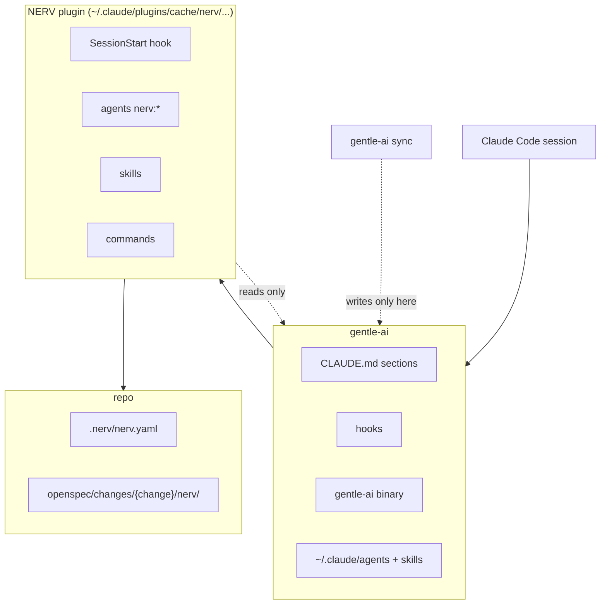
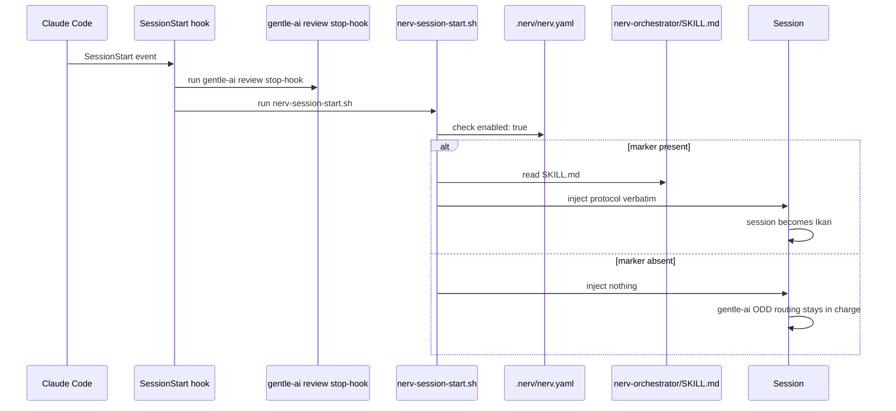
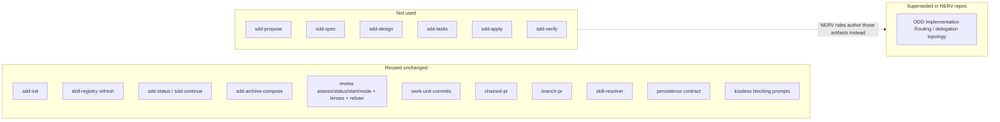
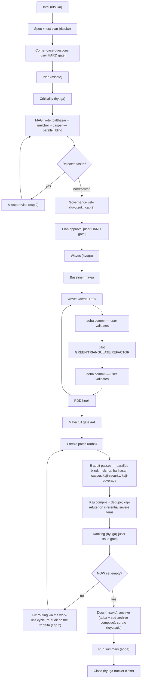
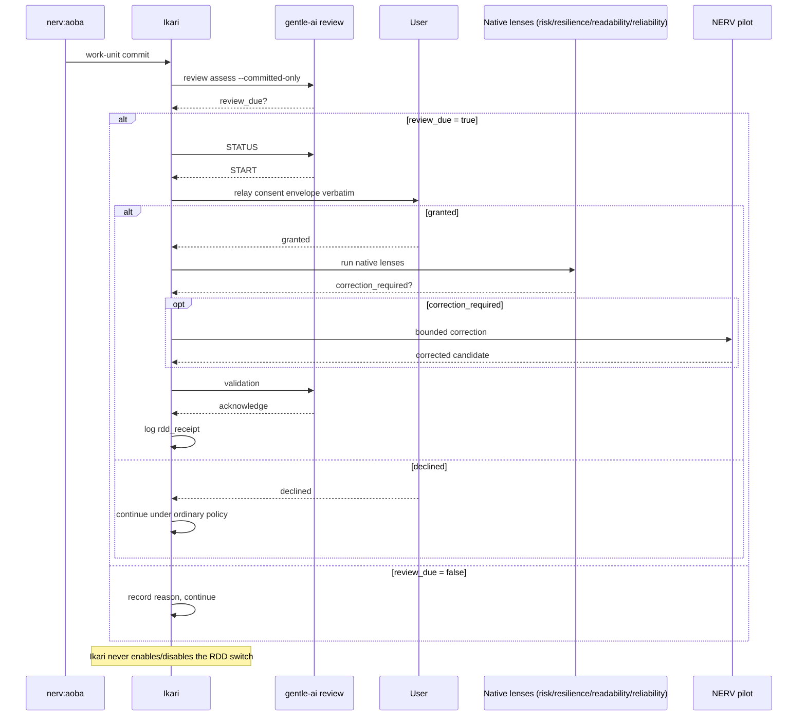

# How NERV Gentle-AI integrates with gentle-ai

### Layering

NERV Gentle-AI sits strictly above gentle-ai and below the repo it
governs: Claude Code loads gentle-ai first (`CLAUDE.md`, its hooks, the
`gentle-ai` binary, and the agents/skills it writes under `~/.claude`),
NERV Gentle-AI's plugin cache layers its own hook, agents, skills, and
commands on top, and the repo carries only NERV Gentle-AI's own state
(`.nerv/nerv.yaml`, the `nerv/` subfolder of each change). `gentle-ai
sync` never sees NERV Gentle-AI's files because NERV Gentle-AI never
writes into the gentle-ai box, and NERV Gentle-AI never writes into it
either — it only reads from it.

### Activation

Every session start runs gentle-ai's own `review stop-hook` first, then
NERV Gentle-AI's `nerv-session-start.sh`. The NERV Gentle-AI hook checks
`.nerv/nerv.yaml` for `enabled: true`; only then does it read and inject
`nerv-orchestrator/SKILL.md` verbatim, which is the moment the session
becomes Ikari. Without the marker the hook injects nothing at all, and
gentle-ai's own ODD Implementation Routing stays in charge of the session.

### Reuse map

NERV Gentle-AI calls a large slice of gentle-ai's native engine completely
unchanged (SDD's read-only/mechanical steps, the whole RDD lifecycle, the
delivery and skill-resolution skills, the persistence and lossless-prompt
contracts). It supersedes exactly one thing — gentle-ai's ODD
Implementation Routing — with its own LIGHT/FULL classification and
pipelines, only in repos carrying the `.nerv/nerv.yaml` marker. It never
touches the authoring half of SDD (`sdd-propose` through `sdd-verify`);
NERV Gentle-AI's own roles (Misato, Ritsuko, the MAGI, the pilots) author
the equivalent artifacts instead.

### LIGHT pipeline

```mermaid
flowchart LR
    A["Preflight"] --> B["Classify: LIGHT"]
    B --> C["nerv:ritsuko intel-light"]
    C --> D["nerv:kaworu RED"]
    D --> E["nerv:aoba commit — user validates"]
    E --> F["pilot GREEN/TRIANGULATE/REFACTOR"]
    F --> G["nerv:maya reduced gate"]
    G --> H["nerv:aoba commit — user validates"]
    H --> I["RDD hook"]
    I --> J["Run summary"]
    J --> K["Close"]
```

LIGHT is the small-change path: after preflight and classification, an
optional Ritsuko micro-intel primes the work, Kaworu writes the failing RED
test, a domain-matched pilot makes it pass, Maya runs a reduced gate scoped
to the touched files only, and Aoba commits twice — once for RED, once
after the gate — each commit validated by the user before it happens. The
RDD hook, run summary, and close steps are shared with FULL.

### FULL pipeline

FULL adds MAGI governance on top of the same LIGHT primitives (RED/GREEN/
REFACTOR, Aoba commits, RDD hook). Ritsuko produces intel and a spec/test
plan gated by a user corner-case interview; Misato's plan goes through
criticality, a blind parallel MAGI vote (with a capped revise loop on
rejection), and Fuyutsuki's governance veto before a single whole-plan user
approval gate. Hyuga's waves then drive per-task implementation cycles
identical to LIGHT's, and Maya runs the full a-d gate. The audit stage then
freezes the patch, runs five blind passes, compiles them through Kaji (with
the refuter on inferential severe items), ranks the issues for a user gate,
routes approved fixes through the work-unit cycle with a re-audit over the
fix delta (capped at 2), and closes with Ritsuko's documentation, the
mechanical archive, Fuyutsuki's log summary, the run summary and the
tracker close.

### RDD per commit

After every Aoba work-unit commit, Ikari assesses that commit against the
last reviewed boundary. When review is due, Ikari relays gentle-ai's native
consent envelope to the user losslessly and verbatim — never deciding on
their behalf. On a grant, the native lenses run, a bounded correction from
a NERV Gentle-AI pilot applies only if one is required, and an
acknowledged receipt is
logged as `rdd_receipt`; on a decline, the run continues under ordinary
repository policy. Ikari itself never enables or disables the RDD switch.

## Roles

Ikari is the main Claude Code session itself, not a spawnable agent — the
sole spawner that launches every role below, classifies each request,
relays every blocking gate to the user, and never delegates that
authority to anyone it launches.

| Agent | Role | Runs when | Produces | Default model / effort | Tools (summary) |
|---|---|---|---|---|---|
| `fuyutsuki` | Governance veto over new skills/scripts/commands; curates the deliberation log | FULL plan step, after the MAGI vote; end of every run | `nerv/veto-ruling.md`; curated `## Summary` in `nerv/deliberation-log.md` | sonnet / medium | Read, Write, Glob, Grep, Engram search/save |
| `misato` | Operations director — authors `proposal.md`/`design.md`/`tasks.md`, revises exactly what the MAGI vote rejects, rules on deviations and test-vs-implementation disputes | FULL plan step; after a rejected MAGI vote or a veto; on demand for a ruling | `proposal.md`, `design.md`, `tasks.md`; ruling entries | fable / high | Read, Write, Glob, Grep, Engram search/save |
| `ritsuko` | Chief scientist — codebase/history intel, test planning with a corner-case interview, end-of-run docs | LIGHT micro-intel; FULL intel and spec/test-plan steps; end-of-run documentation | `exploration-light.md`/`exploration.md`, `specs/{domain}/spec.md`, `nerv/test-plan.md`, doc deltas | opus / high | Read, Glob, Grep, WebFetch, WebSearch, Engram search/save |
| `balthasar` | MAGI vote (VOTE mode): software-principles lens — SOLID, KISS, YAGNI, DRY, patterns; also an AUDIT-mode pass in Phase 3 | FULL blind MAGI vote round, per task; Phase 3 audit round | VOTE/AUDIT JSON, merged by Ikari into `nerv/votes.md`/`nerv/audit-report.md` | sonnet / medium | Read, Glob, Grep, Engram search |
| `melchor` | MAGI vote (VOTE mode): structure/security lens — architecture, dead code, duplication, security; the deliberately strongest MAGI model; also an AUDIT-mode pass | same | same | fable / high | Read, Glob, Grep, Engram search |
| `casper` | MAGI vote (VOTE mode): process lens — docs, comments, scope, commit hygiene, plan consistency; its AUDIT-mode pass also checks plan conformance and TDD commit order | same | same | sonnet / medium | Read, Glob, Grep, Engram search |
| `rei` | Pilot — owns data: persistence, migrations, caches, observability, and that layer's security | GREEN/REFACTOR after Kaworu's RED, on data work units | source and tests in the working tree, TDD evidence | sonnet / medium | Read, Edit, Write, Glob, Grep, Bash, Engram search |
| `shinji` | Pilot — owns the backend and its security | GREEN/REFACTOR after Kaworu's RED, on backend work units | source and tests in the working tree, TDD evidence | sonnet / medium | Read, Edit, Write, Glob, Grep, Bash, Engram search |
| `asuka` | Pilot — owns the frontend: UI, state, accessibility, and client-side security | GREEN/REFACTOR after Kaworu's RED, on frontend work units | source and tests in the working tree, TDD evidence | sonnet / medium | Read, Edit, Write, Glob, Grep, Bash, Engram search |
| `toji` | Pilot — owns infrastructure: CI/CD, Docker, Kubernetes, and infra security | GREEN/REFACTOR after Kaworu's RED, on infra work units (validation commands substitute for RED/GREEN where no runner exists) | source, manifests and pipelines in the working tree, TDD evidence or a validation-commands report | sonnet / medium | Read, Edit, Write, Glob, Grep, Bash, Engram search |
| `kaworu` | Pilot — writes the failing RED test first for every work unit, before any pilot's GREEN step; never a domain owner | before every GREEN step, in both LIGHT and FULL | the RED test file; RED row of the TDD Cycle Evidence table | sonnet / medium | Read, Edit, Write, Glob, Grep, Bash, Engram search |
| `maya` | Quality gate — runs tests/lint/build, reproduces the TDD evidence pilots reported, routes failures to whoever owns them | LIGHT reduced gate; FULL baseline (phase 0) and full a-d gate (phase 2) | `nerv/maya-report.md` | sonnet / medium | Read, Bash, Glob, Grep, Write, Engram search/save |
| `kaji` | Audit compiler — merges and dedupes the five audit passes, prepares the refuter batch, carries unresolved items across re-audit rounds | Phase 3, once per audit round, after the five passes return | `nerv/audit-report.md` | opus / high | Read, Glob, Grep, Write, Engram search/save |
| `kaji-security` | Audit pass — security across every layer: injection, authz, secrets, data exposure, unsafe defaults, dependencies, crypto, infra hardening | Phase 3, one of five parallel blind passes | JSON findings, merged by Kaji into `nerv/audit-report.md` | sonnet / medium | Read, Glob, Grep, Engram search |
| `kaji-coverage` | Audit pass — implemented tests versus Ritsuko's test plan: missing cases, weakened or tautological assertions, untested acceptance criteria | Phase 3, one of five parallel blind passes | JSON findings, merged by Kaji into `nerv/audit-report.md` | sonnet / medium | Read, Glob, Grep, Engram search |
| `kaji-refuter` | Detached, read-only refuter — attacks the round's inferential BLOCKER/CRITICAL findings with concrete counter-evidence | Phase 3, only when Kaji's refuter batch is non-empty | corroborated/refuted/inconclusive verdicts, folded by Kaji into `nerv/audit-report.md`'s `### Refuted` | sonnet / medium | Read, Glob, Grep, Engram search |
| `hyuga` | Plan and issue operations — four dispatches: `criticality`, `waves`, `wave-report`, `ranking`, plus the provider-agnostic task-tracker dispatch | criticality before the MAGI vote; waves after plan approval; wave-report during implementation; ranking after the refuter; tracker at preflight, Maya's full-gate start, the issue gate, and close | `nerv/criticality.md`, `nerv/waves.md`, `nerv/issue-ranking.md`; tracker op result inline | sonnet / medium | Read, Write, Glob, Grep, Bash, Engram search/save, Teamwork MCP |
| `aoba` | Git operations and run telemetry — organizes user-validated commits, freezes audit patches, archives closed changes, writes the run summary | after every user-validated work unit; patch freeze before each audit round; archive and run summary at close | conventional commits, `nerv/audit/diff-round-N.patch`, the archived change folder, `nerv/run-summary.md` | sonnet / low | Bash, Read, Glob, Grep, Write, Engram search/save |

**How a run flows.** Every request is classified once, before the first
agent launch: LIGHT for a small, single-domain change, FULL for anything
touching two or more pilot domains, a critical path, a new
skill/script/command, or a large diff. LIGHT runs one RED/GREEN/REFACTOR
cycle — Kaworu's failing test, a domain-matched pilot, Aoba's
user-validated commits, and a reduced Maya gate — shown in the "LIGHT
pipeline" diagram above. FULL adds Ritsuko's spec and
corner-case interview, Misato's plan, a blind per-task MAGI vote,
Fuyutsuki's governance veto, a whole-plan approval gate, Hyuga's
dependency waves, Maya's full a-d gate, and a five-pass, Kaji-compiled
audit behind a ranked user issue gate, shown in the "FULL pipeline"
diagram above. Both pipelines share the same RED/GREEN/REFACTOR
primitive, the same Aoba commit-and-validate step, and the same native
RDD review relay after every commit, detailed in "RDD per commit" above.

## Operations

**Activation.** A repo opts in by creating `.nerv/nerv.yaml` with
`enabled: true` — `/nerv:init` writes it interactively (base branch,
worktree policy, skill stacks, task-tracker provider), and `/nerv:configure`
revisits any of those choices afterwards. Without the marker a session
behaves like plain gentle-ai; with it, SessionStart injects the NERV
Gentle-AI orchestrator protocol and the session becomes Ikari.

**LIGHT vs. FULL.** Ikari classifies each request LIGHT (one pilot domain,
no new skills/scripts/commands) or FULL (multiple domains, a critical path,
or governance-relevant surface); LIGHT runs a single RED/GREEN/REFACTOR
cycle under a reduced Maya gate, while FULL adds Ritsuko's spec/test-plan,
a blind MAGI vote per task, Fuyutsuki's governance veto, a plan-approval
gate, wave-based implementation, and Kaji's five-pass audit before close.

**Gates a human will see.** The grouped preflight question (task,
worktree, branch, base) when no task/timer is active; a commit-validation
stop before every Aoba commit; the corner-case questions relayed as one
grouped prompt in FULL; the whole-plan approval HARD gate in FULL; the
ranked issue gate after an audit; and the RDD consent envelope after a
commit when review is due. Every one of these is a Lossless Blocking
Prompt — relayed verbatim, never decided on the user's behalf. While one is
open the orchestrator lock carries `waiting_on: user`, so the 15-minute
staleness rule does not apply to it: a resume from another session must
ask before taking over, however long the gate stays open.

**Artifacts.** NERV Gentle-AI writes only under
`openspec/changes/{change}/nerv/` (deliberation log, exploration, test
plan, votes, veto ruling, waves,
Maya reports, audit rounds, run summary) plus the shared gentle-ai SDD
files (`state.yaml`, `proposal.md`, `design.md`, `tasks.md`, `specs/`) at
the change root. `.nerv/nerv.yaml` (project scope) and
`~/.claude/nerv/nerv.yaml` (user scope) hold configuration; nothing is
ever written under `~/.claude/agents` or `~/.claude/skills`.

**Artifacts commit policy.** `artifacts.commit` controls when the `nerv/`
folder is committed: `with-change` (each work-unit commit includes its own
NERV Gentle-AI artifacts), `at-close` (default — artifacts land in one
`docs: nerv artifacts for {change}` commit when the run closes), or
`never` (artifacts stay untracked; the user commits them manually, if
ever).

**Task tracker.** `tasks.provider` selects `teamwork` (implemented today),
`github-projects` or `jira` (schema stubs only, not wired), or `none` (no
tracker calls; the preflight still asks worktree/branch). Hyuga's
`DISPATCH: tracker` drives create/start/moveStage/block/close/done against
the configured provider. The 16 `/task:*` commands read the same single
`nerv.yaml` config (user + project scope) instead of hardcoded values.

**`/nerv:status`.** Reports gentle-ai major-version compatibility, the
active config (merged user + project), and — while a run is in progress —
the orchestrator lock state (`nerv/.orchestrator.lock`: holder, step,
`waiting_on`, heartbeat age); the lock line disappears once the run closes.

**`/nerv:configure`.** Configures `nerv.yaml` (user and project scope),
per-role models, skills, and repository registration through grouped
guided questions instead of hand-editing YAML or the terminal wizard — see
"Setup" in [README.md](../README.md). Read-only in `claude -p`, where it
prints the current config and the exact `--set`/`--set-model` syntax
instead of asking.

### Engram project detection

A second SessionStart hook, `plugin/hooks/nerv-engram-project.sh`, runs in
**every** session — unlike the NERV Gentle-AI activation hook above, it is
not gated behind `.nerv/nerv.yaml` — to tell the session which Engram
project to pass
on every memory write. It detects the project in this order:

1. `.engram/config.json` in the session directory, then in the git
   toplevel (so a nested subfolder still honors the repo-root config), if
   it declares a `project_name` that passes validation: letters, digits,
   dot, underscore, dash, 1–64 characters, alphanumeric first. The name
   `nerv` is reserved for the knowledge base and is refused from any repo
   config (warning on stderr, detection falls through). A repository you
   merely open can therefore not redirect your memory writes to an
   arbitrary or reserved project.
2. Otherwise, the basename of the git toplevel directory (works from any
   nested subfolder).
3. Otherwise, undetermined.

Inside a NERV-enabled repo (`.nerv/nerv.yaml` with `enabled: true`), the
hook also prints a reminder that NERV Gentle-AI keeps a shared knowledge
base in the Engram project named `nerv` — precedents (Misato rulings,
Fuyutsuki vetoes,
MAGI vote results, Kaji audit findings) mirrored from every NERV-governed
repository under topic keys `nerv/kb/{repo}/{change}/{artifact}`, read
before deciding and written back after. When detection is undetermined in
a NERV Gentle-AI repo, the hook falls back to `project: "nerv"` for that
session's
writes instead of leaving it unresolved.

Outside a NERV Gentle-AI repo, an undetermined detection is never
silently guessed:
the hook asks the session to pose one question to the user — general
knowledge under the `root` project, or a specific named project — before
the first Engram write (`mem_save`, `mem_session_summary`, `mem_context`).

`nerv install` keeps a `nerv` Engram project provisioned: when
`engram` is on PATH, it checks `engram projects list` and
creates the `nerv` knowledge-base project if it is missing (idempotent —
a second run makes no changes). Without `engram` on PATH, it warns and
continues; nothing about plugin registration depends on it.
